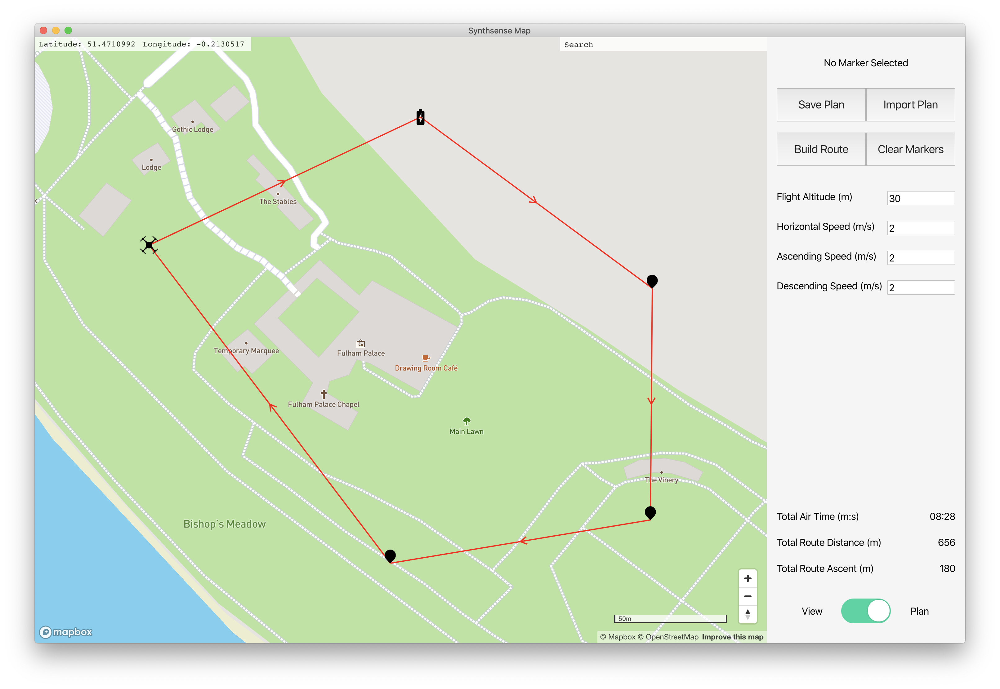

# Synthsense Map

Synthsense Map is a cross-platform desktop mapping application for Synthsense, the main project of the Wireless Power and Control Group at Imperial College London. The application facilitates route and flight parameter planning, data consumption and exploration.



## To Build Mac and Windows Installation Files

Clone the repo, and make sure you have [yarn](https://yarnpkg.com/getting-started/install) installed. Acquire a mapbox API key from [here](https://docs.mapbox.com/help/how-mapbox-works/access-tokens/) and add it to `config.json` within the `/src` directory. Rename the `example.env` file to `.env`, and complete it with Apple application credentials to facilitate the notarizing process. The process used is from [here](https://kilianvalkhof.com/2019/electron/notarizing-your-electron-application/).

cd into the root folder, and run `yarn` to install all the required packages, followed by `yarn electron-pack` which will build the application into Windows and Mac installers in the dist directory.

## Development
With all the required packages installed per the above, run `yarn electron-dev` to launch the main and renderer processes. The renderer process is in hot reload mode and will reflect any new changes immediately. Acquire a mapbox API key from [here](https://docs.mapbox.com/help/how-mapbox-works/access-tokens/) and add it to `config.json` within the `/src` directory.

## Application Overview
The application uses two core libraries - [React](https://reactjs.org/) and [Electron](https://www.electronjs.org/). React powers the front end, and Electron allows the application to interact with OS level functionality, such as native menus and the local filesystem.

There are two modes, view and plan. View allows the user to import data from a returning drone, saving it to the Documents folder and structuring it by sensor. The sensor locations are then plotted on the map, with the user able to view high level key value data from within the application such as battery level, time since visit and location. Other sensor-specific data can then be accessed by selecting `View Data` which will open the sensor folder in the native file explorer for further analysis in the preferred application.

In plan mode, new sensors can be plotted on the map by right clicking and using the prompt. A route can then be plotted from the takeoff point and between the sensors. Each sensor has configurable parameters, all defined within schemas.json including defaults, minimum and maximum values. Plans can be saved and revised at a future data using save and load functionality. When the route is complete, it can be exported to the drone.

A search bar is implemented which uses mapbox's geocoding api, and takes the user to a returned location when selected from the search results.

## Core Application Structure

```text
.
├── package.json
├── public
|   ├── electron.js - main process
|   └── preload.js
├── src
|   ├── index.js
|   ├── index.css
|   ├── index.js
|   ├── schemas.json
|   ├── App.js
|   ├── App.css
|   ├── setupTests.css
|   └── components
|       ├── map.js
|       ├── sidebar.js
|       ├── sidebar.css
|       ├── map
|       |   ├── __tests__
|       |   └── ...components
|       └── sidebar
|           ├── __tests__
|           └── ...components
├── Test Flight Data - can be imported in View mode
└── config.json - Mapbox API key
```